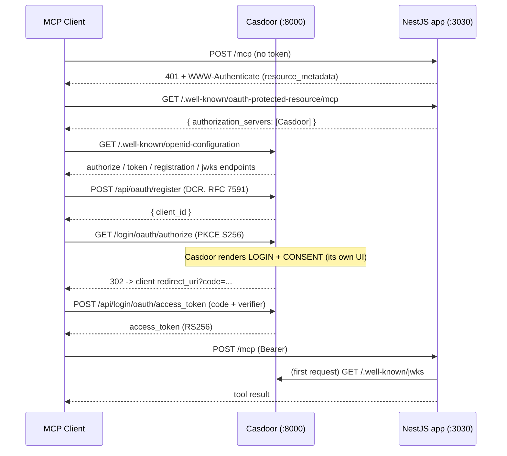

# MCP authentication with a self-hosted external OAuth 2.1 server (Casdoor)

This playground runs **[Casdoor](https://casdoor.org) as a full external OAuth
2.1 / OIDC authorization server** in Docker, with an **MCP-Nest server acting as
a pure OAuth resource server**. The MCP server reuses the shared greeting tools
and accepts only requests that carry a valid Casdoor-issued access token.

It is the companion to [`supabase-mcp-auth`](../supabase-mcp-auth), but makes a
deliberately different architectural point:

> The authorization server owns the **entire** identity story — user **login**,
> the OAuth **consent** screen, and **Dynamic Client Registration**. The MCP
> server contains **no** login or consent code. It only validates tokens.

That is the contrast worth internalizing. In `supabase-mcp-auth`, standalone
GoTrue ships no consent UI, so that example had to render a login + consent
screen *inside the NestJS resource server* (`consent.controller.ts` +
`consent.view.ts`) — which blurs the resource-server / authorization-server
boundary. Casdoor has a built-in login page **and** consent screen **and** RFC
7591 Dynamic Client Registration, so here those files simply **don't exist**.
The resource server is just a resource server.

## Architecture

```
                         ┌───────────────────────────────────────────┐
                         │ docker compose (single container)         │
  ┌────────────┐         │   ┌─────────────────────────────────────┐ │
  │ MCP client │         │   │ Casdoor :8000                        │ │
  │ (Inspector │         │   │  OAuth 2.1 AS + OIDC                 │ │
  │  / script) │         │   │  • login UI   • consent UI          │ │
  └─────┬──────┘         │   │  • DCR (RFC 7591)  • JWKS (RS256)    │ │
        │                │   │  SQLite (no extra DB container)      │ │
        │                │   └─────────────────────────────────────┘ │
        │                └───────────────────────────────────────────┘
        │ 1. POST /mcp (no token) ──▶ resource server
        │ ◀── 401 + WWW-Authenticate: resource_metadata=...
        │
        │ 2. GET /.well-known/oauth-protected-resource/mcp ──▶ MCP-Nest
        │ ◀── { authorization_servers: ["http://localhost:8000"] }
        │
        │ 3. discover + DCR + login + consent + token ─────▶ Casdoor :8000
        │ ◀── access_token (RS256 JWT)
        │
        │ 4. POST /mcp  Authorization: Bearer <token> ─────▶ ┌─────────────┐
        │ ◀── tool result                                    │ MCP-Nest    │
        └────────────────────────────────────────────────── │ :3030 /mcp  │
                                                             │ (resource)  │
                                                             └─────────────┘
```

- **Casdoor** issues access tokens (RS256 JWTs), hosts the login + consent
  screens, and exposes the OAuth 2.1 / OIDC endpoints (authorize, token,
  dynamic client registration, RFC 8414 / OIDC discovery, JWKS).
- **MCP-Nest** (`main.ts`) runs as a `McpStrategy` microservice with
  `StreamableHttpTransport`. The `/mcp` route is a real NestJS controller
  (`McpHttpController`, which extends `McpHttpControllerFor(mcpTransport)`), and a
  NestJS guard (`CasdoorAuthGuard`) validates the Bearer token against Casdoor's
  **published JWKS** — no shared secret. A `WellKnownController` serves the RFC
  9728 protected-resource metadata pointing at Casdoor.

  > **Why a guard, not middleware?** Authenticating with a guard on a real
  > controller is the idiomatic NestJS way: `@UseGuards(CasdoorAuthGuard)` covers
  > the whole MCP surface in one place and composes with interceptors, filters and
  > versioning. The controller owns the `/mcp` route — `McpHttpControllerFor(mcpTransport)`
  > reads `mcpTransport.httpHandlers` at class-definition time, which auto-disables
  > the transport's own self-mount, so there's no double-registration and no
  > `mount: false` flag to remember. The Express-middleware alternative is kept in
  > `casdoor-jwt.middleware.ts` for reference.



## What makes Casdoor work as the MCP authorization server

Everything is configured declaratively so the stack boots ready-to-use:

| Piece | Where | Purpose |
|---|---|---|
| `dcrPolicy: "open"` on the `built-in` org | `casdoor/init_data.json` | Enables RFC 7591 Dynamic Client Registration (off by default) |
| `defaultApplication: "app-built-in"` | `casdoor/init_data.json` | DCR-created apps inherit Password sign-in + branding from it |
| `hasPrivilegeConsent: true` | `casdoor/init_data.json` | Lets the seed add users to the `built-in` org |
| `app-built-in` with fixed `clientId`/`clientSecret` | `casdoor/init_data.json` | Stable creds for the non-interactive `client_credentials` token script |
| `origin` / `originFrontend = http://localhost:8000` | `casdoor/conf/app.conf` | Makes discovery advertise `authorize` on `:8000` (else Casdoor defaults to `:7001`) |
| SQLite (`driverName = sqlite`) | `casdoor/conf/app.conf` | Single container, no separate database |

Endpoints Casdoor exposes (discover them at
`http://localhost:8000/.well-known/openid-configuration`):

- `GET  /.well-known/openid-configuration` — OIDC / RFC 8414 metadata
- `GET  /.well-known/jwks` — RS256 public keys (the resource server validates with these)
- `POST /api/oauth/register` — dynamic client registration (RFC 7591)
- `GET  /login/oauth/authorize` — authorization code + PKCE (renders login + consent)
- `POST /api/login/oauth/access_token` — token endpoint

> Requires a Casdoor build with the DCR endpoint (`/api/oauth/register`) and
> per-organization `dcrPolicy`. This playground uses `casbin/casdoor:latest`;
> pin a specific tag/digest in `docker-compose.yml` for reproducibility.

### Seeded accounts (dev only)

| Who | Username / Password | Notes |
|---|---|---|
| Demo user | `joe` / `password123` | Use this to log in during the browser flow |
| Casdoor admin | `admin` / `admin123` | Casdoor console at http://localhost:8000 |
| OAuth client (for the token script) | clientId `mcp-playground-client`, secret `mcp-playground-secret-dev-only` | `app-built-in`, `client_credentials` grant |

## Prerequisites

- Docker + Docker Compose
- Node deps installed at the repo root (`npm install`)
- Ports free on the host: **8000** (Casdoor), **3030** (MCP).
  If `8000` is taken, see [Port conflicts](#port-conflicts).

## Run it (happy path)

All commands are run from this directory unless noted:

```bash
cd playground/servers/external-mcp-auth
```

**1. Start Casdoor and wait until it answers**

```bash
docker compose up -d

# wait for the OIDC discovery document to be served
until curl -sf http://localhost:8000/.well-known/openid-configuration >/dev/null; do
  echo "waiting for Casdoor..."; sleep 2
done
echo "Casdoor is ready"
```

**2. Sanity-check the OAuth 2.1 server**

```bash
# OIDC metadata (note registration_endpoint => DCR is available)
curl -s http://localhost:8000/.well-known/openid-configuration | jq \
  '{authorization_endpoint, token_endpoint, registration_endpoint, jwks_uri}'

# Dynamic Client Registration returns a client_id
curl -s -X POST http://localhost:8000/api/oauth/register \
  -H 'Content-Type: application/json' \
  -d '{"client_name":"demo","redirect_uris":["http://localhost:6274/oauth/callback"],"grant_types":["authorization_code","refresh_token"],"token_endpoint_auth_method":"none","application_type":"native"}' | jq
```

**3. Start the MCP server (resource server)** — in a second terminal, from the repo root:

```bash
npm run start:external-auth
# MCP endpoint: http://localhost:3030/mcp  (Bearer required)
```

**4. Mint a token and call a tool (non-interactive)**

```bash
cd playground/servers/external-mcp-auth

# client_credentials grant against app-built-in -> a Casdoor RS256 JWT
./scripts/get-token.sh

# Call the greeting tool with the token (from the repo root):
cd ../../..
ACCESS_TOKEN=$(playground/servers/external-mcp-auth/scripts/get-token.sh) \
  npx ts-node-dev -r tsconfig-paths/register \
  playground/servers/external-mcp-auth/scripts/call-tool.ts
```

Expected output:

```
Connected to http://localhost:3030/mcp
Available tools: greet-logged-in-user, greet-world, public-greet-world, greet-user, ...
greet-world result: "Hello, World!"
```

**5. Confirm auth is actually enforced**

```bash
# No token => 401 with a discovery hint
curl -s -i -X POST http://localhost:3030/mcp \
  -H 'Content-Type: application/json' \
  -H 'Accept: application/json, text/event-stream' \
  -d '{"jsonrpc":"2.0","id":1,"method":"initialize","params":{"protocolVersion":"2025-06-18","capabilities":{},"clientInfo":{"name":"c","version":"1"}}}' \
  | grep -E 'HTTP/|WWW-Authenticate'
# => HTTP/1.1 401 Unauthorized
# => WWW-Authenticate: Bearer resource_metadata="http://localhost:3030/.well-known/oauth-protected-resource/mcp"
```

**6. Tear down**

```bash
docker compose down        # add -v style cleanup: the SQLite db lives in ./casdoor/data (gitignored)
```

## The full interactive OAuth flow (with the MCP Inspector)

Unlike `supabase-mcp-auth`, there is **nothing to render here** — Casdoor hosts
the login and consent screens. With the stack up (step 1) and the MCP server
running (step 3):

```bash
npx @modelcontextprotocol/inspector
```

1. Set **Transport** to *Streamable HTTP* and **URL** to `http://localhost:3030/mcp`.
2. Click **Connect** → **Open OAuth flow**. The Inspector does DCR against
   Casdoor (`POST /api/oauth/register`) and starts the authorization-code flow.
3. A browser tab opens **Casdoor's** login page. Sign in as **`joe` /
   `password123`**, then approve on **Casdoor's** consent screen.
4. The Inspector receives the code, exchanges it at Casdoor's token endpoint, and
   connects. Call `greet-world` → `"Hello, World!"`, or `greet-user` with
   `{"name":"joe","language":"en"}`.

## How the resource server validates tokens

`CasdoorAuthGuard` (sharing its verification with `casdoor-token.ts`) fetches
Casdoor's JWKS once and verifies every Bearer token's **signature (RS256)**,
**issuer**, and **expiry**. There is no shared secret between the AS and the
resource server — the opposite of the HS256 shared-secret approach in
`supabase-mcp-auth`. On a missing/invalid token the guard returns `401` with a
`WWW-Authenticate` header pointing at the protected-resource metadata.

> **Audience note (RFC 8707):** Casdoor sets the token `aud` to the OAuth
> *client_id*, not the MCP resource URL that the MCP spec would like to see in
> `aud`. So this playground does **not** enforce an audience — it trusts any
> validly-signed, unexpired token from the configured issuer. To tighten this,
> configure Casdoor token customization to emit the resource URL as the audience
> and pass `audience` to `verifyCasdoorToken` in `casdoor-auth.guard.ts`.

## Files

| File | Role |
|---|---|
| `docker-compose.yml` | Casdoor (OAuth 2.1 AS + DCR), SQLite, single container |
| `casdoor/conf/app.conf` | Casdoor backend config (SQLite + public URLs + seed file) |
| `casdoor/init_data.json` | Declarative seed: `built-in` org (DCR on), `app-built-in`, users |
| `casdoor/data/` | Runtime SQLite db + logs (gitignored; re-seeded each boot) |
| `mcp.runtime.ts` | The `StreamableHttpTransport` + `McpStrategy` instances |
| `mcp.controller.ts` | `McpHttpController extends McpHttpControllerFor(mcpTransport)` — the guarded `/mcp` route |
| `casdoor-auth.guard.ts` | NestJS guard: validates Casdoor RS256 tokens; emits `WWW-Authenticate` on 401 |
| `casdoor-token.ts` | Shared JWKS verification (used by the guard and the middleware) |
| `app.module.ts` | Controllers (incl. `McpHttpController`) + guard |
| `main.ts` | Bootstrap: adapter → microservice → listen (no auth middleware) |
| `casdoor-jwt.middleware.ts` | ALTERNATIVE (not wired): the same validation as Express middleware |
| `well-known.controller.ts` | RFC 9728 protected-resource metadata (points at Casdoor) |
| `scripts/get-token.sh` | Mints a Casdoor token via `client_credentials` |
| `scripts/call-tool.ts` | Minimal MCP client that calls `greet-world` with a Bearer token |

Configurable via env: `PORT` (3030), `SERVER_URL`, `CASDOOR_URL` (8000),
`CASDOOR_HOST_PORT` (compose), `CLIENT_ID` / `CLIENT_SECRET` (token script).

## Troubleshooting

### Port conflicts
If host port `8000` is taken, run Casdoor on another port and point the MCP
server at it:

```bash
CASDOOR_HOST_PORT=8001 docker compose up -d
# NOTE: also set `origin`/`originFrontend` in casdoor/conf/app.conf to
# http://localhost:8001 so discovery advertises the right port, then:
CASDOOR_URL=http://localhost:8001 npm run start:external-auth
CASDOOR_URL=http://localhost:8001 ./scripts/get-token.sh
```

### DCR returns `dynamic client registration is disabled for this organization`
The `built-in` org needs `dcrPolicy: "open"` (set in `casdoor/init_data.json`).
The seed is applied on every boot; if you edited it, recreate the stack:
`docker compose down && docker compose up -d`.

### Reset all Casdoor state
State is re-seeded from `init_data.json` on each boot, but to wipe the SQLite db
entirely:

```bash
docker compose down
rm -f casdoor/data/casdoor.db
docker compose up -d
```
